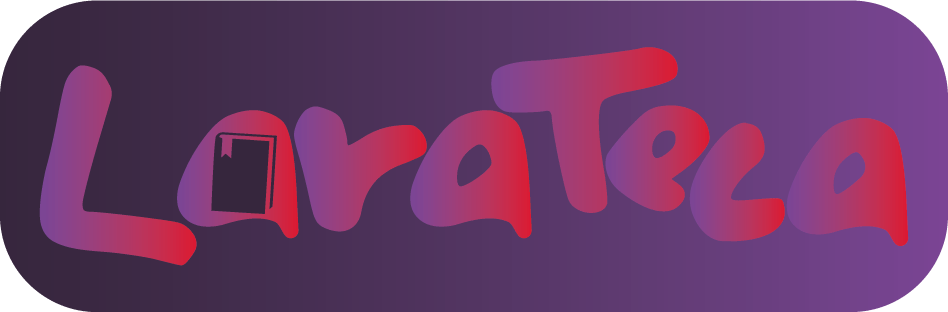

<p align="center"><a href="https://laravel.com" target="_blank"></a></p>
<p align="center">
  
</p>

## Sobre o Projeto
Este é um projeto desenvolvido utilizando o framework Laravel v10.
## Sistema de Gerenciamento de Biblioteca

### Descrição:
Larateca é um sistema de gerenciamento de biblioteca desenvolvido com o framework Laravel. Ele oferece uma interface amigável e intuitiva para gerenciar livros, leitores, empréstimos e consulta de autores em uma biblioteca.

### Recursos e Funcionalidades:
- **Gestão de Livros:** Permite adicionar, visualizar, editar e excluir informações sobre os livros disponíveis na biblioteca. Cada livro pode conter detalhes como título, autor, ISBN, gênero e número de páginas.
- **Gestão de Leitores:** Facilita o cadastro e a gestão de leitores, com informações como nome, e-mail, telefone e endereço.
- **Registro de Empréstimos:** Registra empréstimos de livros para leitores cadastrados, mantendo o controle das datas de empréstimo e devolução.
- **Gestão de Autores:** Permite cadastrar e gerenciar informações sobre os autores dos livros, incluindo nome, biografia e nacionalidade.

### Tecnologias Utilizadas:
- **Laravel:** Escolhemos o framework PHP Laravel devido à sua robustez, facilidade de uso e ampla gama de recursos integrados, como sistema de roteamento, controle de acesso, e facilitadores para manipulação de banco de dados.
- **Bootstrap:** Utilizamos o framework front-end Bootstrap para criar uma interface de usuário responsiva e estilizada, garantindo uma experiência consistente em diferentes dispositivos e navegadores.
- **MySQL:** Optamos pelo sistema de gerenciamento de banco de dados relacional MySQL devido à sua confiabilidade, desempenho e ampla adoção na comunidade de desenvolvimento web. Exploramos as seguintes vantagens do MySQL no projeto:
  - **Desempenho:** O MySQL oferece excelente desempenho em consultas complexas e operações de CRUD, garantindo uma resposta rápida do sistema, mesmo com grandes volumes de dados.
  - **Confiabilidade:** A robustez e estabilidade do MySQL garantem a integridade dos dados da biblioteca, minimizando o risco de falhas e perdas de informações.
  - **Escalabilidade:** O MySQL é altamente escalável, permitindo que o sistema cresça conforme a demanda, sem comprometer o desempenho ou a disponibilidade.

### Objetivos:
- Desenvolver uma aplicação web completa para gestão de bibliotecas, demonstrando proficiência em Laravel, Bootstrap e MySQL.
- Explorar as funcionalidades avançadas do Laravel, como Eloquent ORM para interação com o banco de dados e Blade templating engine para criação de interfaces dinâmicas.
- Criar uma interface intuitiva e amigável para usuários finais, permitindo uma experiência de gerenciamento eficiente e satisfatória.


## Requisitos
- PHP >= 8.2
- Composer
- Banco de dados MySQL
- Servidor web (por exemplo, Apache, Nginx)

## Instalação
1. Clone este repositório:
   ```bash
   git clone https://github.com/Carlos-Devico/larateca.git

2. Acesse o diretório do projeto:
   ```bash
   cd larateca
3. Instale as dependências do Composer:
   ```bash
   composer install
4. Acesse o diretório do projeto::
   ```bash
   cp .env.example .env

5. Gere a chave de aplicação:
   ```bash
    php artisan key:generate

6. Configure o arquivo .env com as informações do seu banco de dados.
   
7. Execute as migrações do banco de dados:
   ```bash
   php artisan migrate
8. Inicie o servidor de desenvolvimento:
   ```bash
   php artisan serve

### Desenvolvedor:
- **Nome:** Carlos Vieira
- **Contato:** carlosdevico@gmail.com


## License

The Laravel framework is open-sourced software licensed under the [MIT license](https://opensource.org/licenses/MIT).
